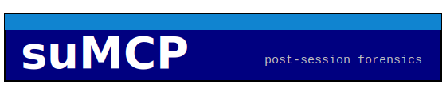
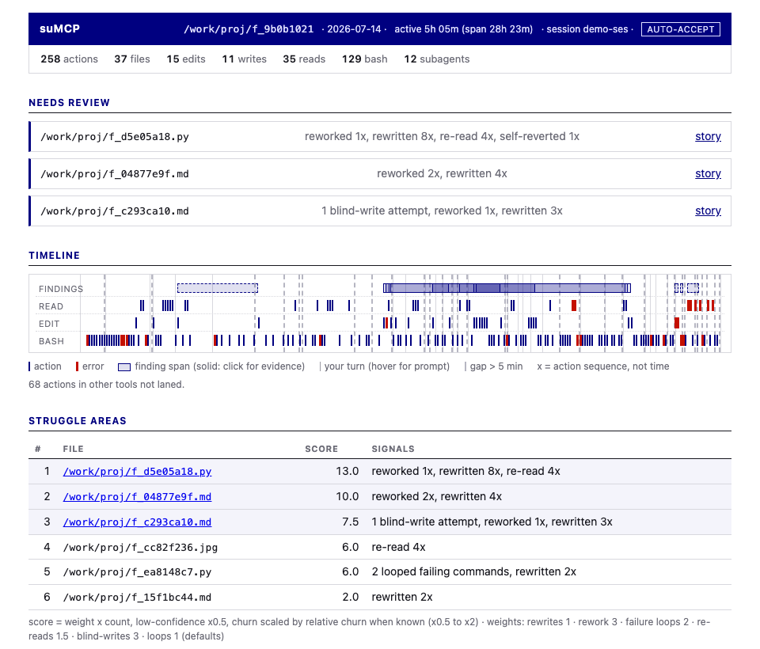
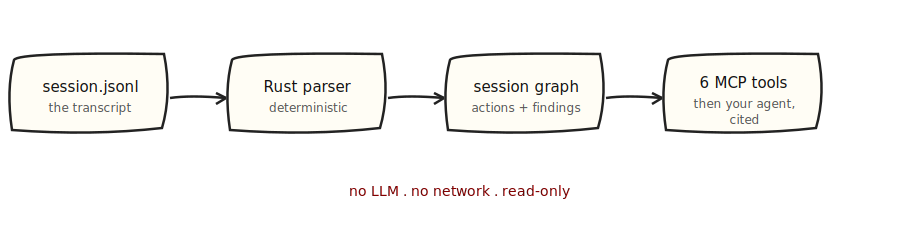
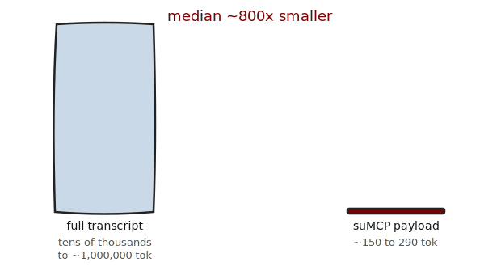

<p align="center">
  
</p>

<p align="center"><b>The agent tells you what it built. suMCP tells you what it actually did.</b></p>

<p align="center">
  
  
  
  
</p>

<p align="center">
  
</p>

> **v0.1 pre-release.** Validated on the author's own projects across many
> session types. The ranking is proven to run and generalize; its top-3
> accuracy has been spot-checked, not yet systematically measured (see
> [Limitations](#limitations)). Not yet published to crates.io.

---

## Why I built this

I ship code an agent wrote faster than I can fully review it. The question
at the end of a session is not "what did we do?" but "which of this do I
actually need to look at before I trust it?"

Ask the agent and it answers from a lossy, self-flattering memory of its own
context, or it re-reads an enormous transcript. The transcript is the real
evidence: every edit, every failed command, every time I pushed back, ordered
and timestamped. suMCP reads that record deterministically, in Rust, with no
LLM and no network, and turns it into review targeting: the files the session
actually struggled with, why, and the exact actions that prove it. The tool
does not judge; it shows its work, so your limited review time goes where the
risk is.

---

## Install

Requires a stable Rust toolchain (`rustup`).

```bash
git clone https://github.com/rbh227/suMCP && cd suMCP
cargo build --release
./target/release/sumcp install          # dry-run: prints exactly what it will write
./target/release/sumcp install --apply  # register the MCP server, debrief skill, and Stop hook
```

`install` writes only under `$HOME` (everything self-contained in
`~/.claude/sumcp/`), backs up any file it touches, and is fully reversible:

```bash
sumcp uninstall --apply   # removes exactly what install added; restores backups
```

Restart Claude Code so it picks up the new user-scope server. See
[docs/](docs/) for the write contract (ADR A8).

---

## Quickstart

Instant debrief on any transcript, no server needed:

```bash
sumcp --file <path/to/session.jsonl>          # ranked struggle areas, human-readable
sumcp --file <path/to/session.jsonl> --json   # the session_overview payload
sumcp --file <path/to/session.jsonl> --html   # a self-contained HTML report
```

Once installed, at the end of a session the Stop hook nudges you to run the
**debrief skill**, which calls the tools below and narrates the result.

---

## The six tools

All read-only; all return compact JSON evidence, never narration.

| Tool | What it returns |
|------|-----------------|
| `session_overview` | Totals, token economics, and top-3 struggle files. **Start here.** |
| `struggle_areas` | Ranked struggle files with a per-category score breakdown, the weights used, and evidence-backed findings. |
| `file_story` | Chronological event story for one file (head + tail kept, middle elided). |
| `blind_spots` | Blind-write attempts, review-burden findings, and large-write-instant-accept outliers, with suppression status for heuristic metrics. |
| `context_health` | Cache hit ratio and token economics (informational). |
| `evidence` | Dereference a finding's `idxs` into the raw actions that prove them (≤10 actions, excerpts ≤600 chars). |

---

## How it works

<p align="center">
  
</p>

`locate → ingest → model → signals → score → Report`. suMCP parses transcripts
permissively (a bad line never fails a file), merges any subagent transcripts
into one totally-ordered timeline, then runs pure functions that look for
edit-shape churn, rework, re-reads, failure loops, reverts, and comprehension
signals. Every finding carries a **tier**, an **exact-vs-heuristic** flag, a
**confidence**, and the action indices that prove it. See
[docs/metrics.md](docs/metrics.md) for the reader-facing catalog, or
[docs/metrics-spec.md](docs/metrics-spec.md) for the authoritative spec.

---

## The numbers

<p align="center">
  
</p>

A supporting point: the evidence arrives cheap. On 15 real sessions across 6
project types (Rust, Python/ML, TS/React, prose, and more), the core debrief
payload was about 150 to 290 tokens against raw transcripts of tens of
thousands to about 1,000,000 tokens: a median ~800x reduction.[^tok] Same
answer, a fraction of the context.

[^tok]: Measured as the `session_overview` payload vs the full transcript at
`chars/3.5`. A full debrief that also reads `struggle_areas` plus a few
`evidence` calls is a small multiple of that, still one to three orders of
magnitude smaller than re-reading the transcript.

---

## Limitations

Read these before trusting a ranking:

- **Accuracy not yet systematically validated.** The ranking is proven to *run*
  and *generalize* across many real projects, but whether its top-3 struggle
  files match what you *actually* struggled with has only been spot-checked, not
  measured. Treat the ranking as a strong hint, not ground truth, in v0.1.
- **Heuristic signals.** Several signals (e.g. approval latency, instant-accept)
  infer intent from edit shape and timing; they're labeled heuristic and are
  suppressed when the session ran under auto-accept.
- **Single-session only.** No cross-session/project memory yet (a planned v0.2
  direction).
- **Single-user validation.** v0.1 is validated on the author's own projects,
  not by external users. External validation is the top post-v0.1 item.

---

## License

Dual-licensed under either of

- Apache License, Version 2.0 ([LICENSE-APACHE](LICENSE-APACHE))
- MIT license ([LICENSE-MIT](LICENSE-MIT))

at your option.
