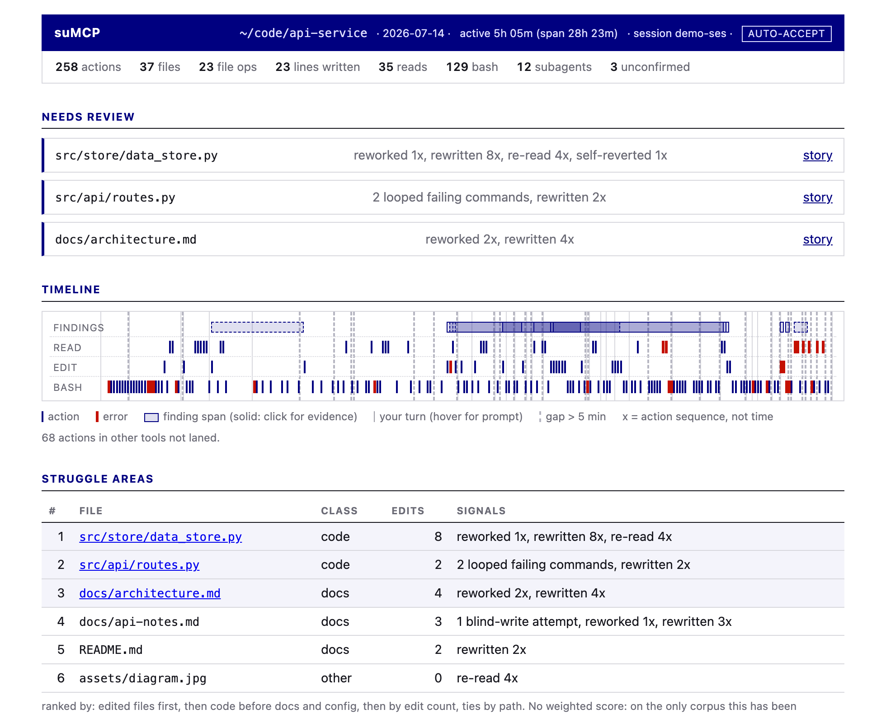
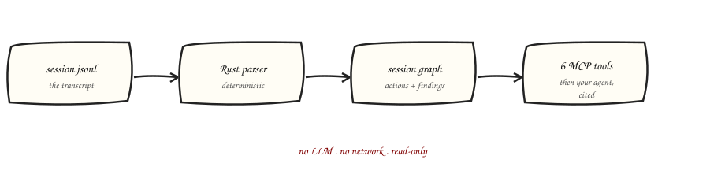
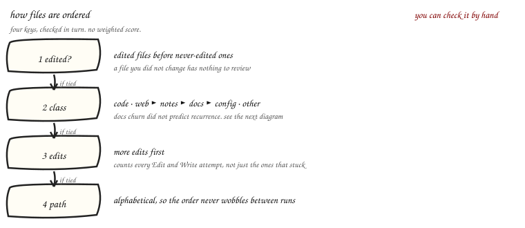
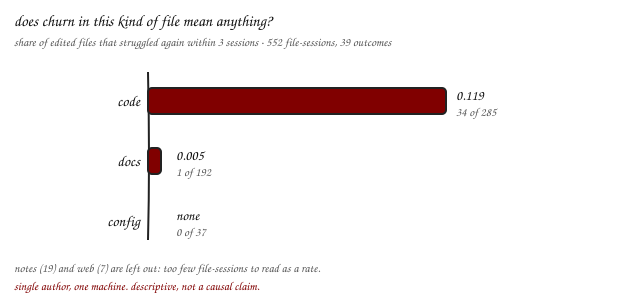
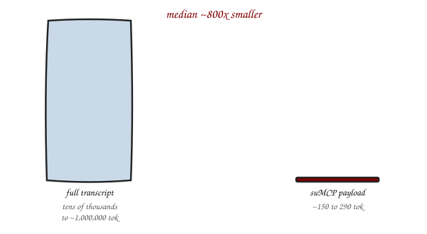

<p align="center">
  
</p>

<p align="center"><b>The agent tells you what it built. suMCP tells you what it actually did.</b></p>

<p align="center">
  
  
  
  
  
</p>

<p align="center">
  
</p>

> **v0.1.0 is released.** Prebuilt archives for macOS (Apple Silicon and Intel),
> Linux (glibc and static musl), and Windows are on the
> [releases page](https://github.com/rbh227/suMCP/releases/latest), each with a
> SHA-256 checksum. Not on crates.io: the unit of distribution is an archive
> carrying both binaries, because `install` needs them side by side.
>
> **What is and is not established.** The flags are predictive: on a 43-session
> corpus, files suMCP flagged recurred at roughly 8 to 9 times the rate of
> unflagged ones. The ordering is a rule you can verify by hand, not a tuned
> model, because a tuned model was measured and did not beat counting edits.
> No external user has validated any of this yet, which is the honest limit on
> everything below. See [Limitations](#limitations).

---

## Why I built this

I ship code an agent wrote faster than I can fully review it. The question
at the end of a session is not "what did we do?" but "which of this do I
actually need to look at before I trust it?"

Ask the agent and it answers from a lossy, self-flattering memory of its own
context, or it re-reads an enormous transcript. The transcript is the real
evidence: every edit, every failed command, every time I pushed back, ordered
and timestamped. suMCP reads that record deterministically, in Rust, with no
LLM and no network, and turns it into review targeting: the files the session
actually struggled with, why, and the exact actions that prove it. The tool
does not judge; it shows its work, so your limited review time goes where the
risk is.

---

## Install

**Supported platforms:** macOS (Apple Silicon and Intel), Linux (x86-64), and
Windows (x86-64). Every one of them is built AND executed in CI on every push,
and the full test suite runs on Linux, macOS, and Windows.

Two things differ on Windows, both stated rather than discovered:

- **No end-of-session nudge.** The Stop hook is a `/bin/sh` script, so it is not
  installed on Windows. Everything else `install` does works: the MCP server is
  registered and the debrief skill is placed. Run the debrief yourself instead
  of waiting to be prompted.
- **Installed files are not permission-restricted.** On Unix the installer
  chmods what it writes (0700 directories, 0600 data) so another account cannot
  read your Claude Code config. Windows has no mode bits, and the ACL
  equivalent would mean a new dependency, so files inherit whatever your user
  profile directory already grants. That is normally private to you, but it is
  not explicitly locked down the way the Unix install is.

Running inside WSL is also fine, and is the better option if you want the hook:
WSL is Linux, so use the Linux archive there.

Every archive contains **both** binaries, `sumcp` and `sumcp-mcp`. `install`
registers the MCP server by looking for `sumcp-mcp` as a sibling of `sumcp`, so
keep the two together. Installing one without the other leaves a broken
registration.

### From a release archive

Download for your platform from the
[latest release](https://github.com/rbh227/suMCP/releases/latest):

```bash
# macOS, Apple Silicon. Swap the target for x86_64-apple-darwin (Intel Mac),
# x86_64-unknown-linux-gnu (Linux), or x86_64-pc-windows-msvc (Windows).
V=v0.1.0; T=aarch64-apple-darwin
curl -LO https://github.com/rbh227/suMCP/releases/download/$V/sumcp-$V-$T.tar.gz
curl -LO https://github.com/rbh227/suMCP/releases/download/$V/sumcp-$V-$T.tar.gz.sha256

# Verify before running it. Expect "sumcp-...tar.gz: OK".
shasum -a 256 -c sumcp-$V-$T.tar.gz.sha256   # Linux: sha256sum -c

tar -xzf sumcp-$V-$T.tar.gz && cd sumcp-$V-$T
./sumcp install          # dry-run: prints exactly what it will write
./sumcp install --apply  # register the MCP server, debrief skill, and Stop hook (Unix)
```

**macOS signing.** The binaries carry only the ad-hoc signature Rust applies at
link time. That is enough for them to run, but it carries no developer identity,
so they are **not notarized**: this project has no Apple Developer ID. A `curl`
download is not quarantined and will just work. A browser download is
quarantined, and Gatekeeper will refuse it until you clear the attribute:

```bash
xattr -dr com.apple.quarantine sumcp sumcp-mcp
```

Verify what you got, rather than taking the above on trust:

```bash
codesign -dvv ./sumcp   # expect "Signature=adhoc" until a Developer ID is set up
```

Notarization needs a paid Apple Developer ID, which this project does not have,
so it is not planned. In practice this matters only if you download through a
browser: the `curl` commands above are never quarantined.

**Both platforms are exercised before publishing.** Every archive's `sumcp` is
executed in CI and made to analyze a real fixture, including the Intel macOS
build, which is cross-compiled on an arm64 runner and run through Rosetta 2. A
binary that links but cannot start, or starts but cannot parse a transcript,
fails the build rather than reaching you.

Two Linux archives are published. `x86_64-unknown-linux-gnu` is the default.
If it fails with a `GLIBC_2.3x not found` error, which happens on older
distributions such as Ubuntu 22.04 and Debian 12, use
`x86_64-unknown-linux-musl` instead: it is statically linked and depends on no
system libc at all.

### From source

**Minimum Rust version:** 1.88. This is enforced by a CI job, not just
declared: the code uses let-chains, which stabilized in 1.88, so 1.87 fails to
compile. Building from source is also the path for `aarch64` Linux, which has
no published archive.

```bash
git clone https://github.com/rbh227/suMCP && cd suMCP
cargo build --release
./target/release/sumcp install          # dry-run: prints exactly what it will write
./target/release/sumcp install --apply  # register the MCP server, debrief skill, and Stop hook (Unix)
```

`install` writes only under `$HOME` (everything self-contained in
`~/.claude/sumcp/`), backs up any file it touches, and is fully reversible:

```bash
sumcp uninstall --apply   # removes exactly what install added; restores backups
```

Restart Claude Code so it picks up the new user-scope server. See
[docs/](docs/) for the write contract (ADR A8).

---

## Quickstart

Run it with no arguments in a project you have worked in. It finds that
project's most recent session and debriefs it:

```bash
cd ~/code/your-project
sumcp
```

It prints which session it picked to stderr, so `--json` and `--html` stay
pipeable. Add a flag to change the format, or `--file` to pick a session
yourself:

```bash
sumcp --json                                  # the session_overview payload
sumcp --html > report.html                    # a self-contained HTML report

sumcp --file <path/to/session.jsonl>          # ranked struggle areas, human-readable
sumcp --file <path/to/session.jsonl> --json   # the session_overview payload
sumcp --file <path/to/session.jsonl> --html   # a self-contained HTML report
```

Once installed, at the end of a session the Stop hook nudges you to run the
**debrief skill**, which calls the tools below and narrates the result. On
Windows there is no hook, so run the debrief yourself; see
[Install](#install).

---

## The six tools

All read-only; all return compact JSON evidence, never narration.

| Tool | What it returns |
|------|-----------------|
| `session_overview` | Totals, token economics, and top-3 struggle files. **Start here.** |
| `struggle_areas` | Ranked struggle files with each file's class, edit count, per-category breakdown, the ranking rule that ordered them, and evidence-backed findings. |
| `file_story` | Chronological event story for one file (head + tail kept, middle elided). |
| `blind_spots` | Secrets-file touches, blind-write attempts, review-burden findings, and large-write-instant-accept outliers, with suppression status for heuristic metrics. |
| `context_health` | Cache hit ratio and token economics (informational). |
| `evidence` | Dereference a finding's `idxs` into the raw actions that prove them (≤10 actions, excerpts ≤600 chars). |

---

## How it works

<p align="center">
  
</p>

`locate → ingest → model → signals → rank → Report`. suMCP parses transcripts
permissively (a bad line never fails a file), merges any subagent transcripts
into one totally-ordered timeline, then runs pure functions that look for
edit-shape churn, rework, re-reads, failure loops, reverts, and comprehension
signals. Every finding carries a **tier**, an **exact-vs-heuristic** flag, a
**confidence**, and the action indices that prove it. Findings explain and cite;
they do not vote on a score. See
[docs/metrics.md](docs/metrics.md) for the reader-facing catalog, or
[docs/metrics-spec.md](docs/metrics-spec.md) for the authoritative spec.

### How it ranks

<p align="center">
  
</p>

There is no score. Every ranked entry carries `class`, `edits`, the per-category
breakdown of findings about it, and `ranking_rule`: that sentence, shipped
alongside the order it produced. You can check any report by hand.

The reason there is no score is the next section.

---

## The numbers

**Do the flags mean anything?** Yes. **Did the clever weighting produce that?**
No, and the weighting is gone because of it.

On the author's own corpus (43 sessions, 552 file-sessions, one project held
out), files suMCP flagged for review were **8.9x more likely** to show renewed
struggle (failure loops, user corrections, reverts, or re-qualifying for review)
in the next 3 sessions than unflagged edited files.

**The same study put that ranking against one-line baselines, and it lost.**
Sorting files by edit count and taking the top 3 did at least as well on
relative risk, precision, and miss rate at once. The reason is structural: the
product's flags fired on zero files edited fewer than twice, so the weighted
score was a refinement of edit count rather than an independent signal.

So the obvious next move was to tune the weights. That was tried, and the result
is why this section is short. Weights were fitted to maximize hits **with the
outcomes already in hand**, which is cheating and therefore an upper bound on
any honest rule. Cheating bought at most **4 more hits out of 39**, and the fit
put maximum weight on edit count anyway. There was nothing to tune into, so the
score was deleted rather than adjusted.

What did survive the measurement was file class:

<p align="center">
  
</p>

Documentation was 35% of the population and carried 1 of 39 outcomes. Config
carried none. Ranking code ahead of both cut flagged files from 65 to 52 for an
**identical hit count**: a fifth fewer false alarms at no cost to recall. That is
the whole basis for the class key, and the only tier boundary the data actually
supports. Full breakdown, thin cells and all, in
[the measurement note](docs/validation/2026-07-26-file-class-measurement.md).

So the honest claim is narrow: **suMCP surfaces a genuinely predictive signal,
orders it by a rule you can verify by hand, and attaches citable evidence to
every entry.** That is a usability claim, not an accuracy claim. Single author,
39 outcomes total, so it is equally underpowered to claim the baseline is
*better*. Method, comparison tables, confidence intervals and caveats in
[the predictive-validity study](docs/validation/2026-07-22-predictive-validity.md).

<p align="center">
  
</p>

A supporting point: the evidence arrives cheap. On 15 real sessions across 6
project types (Rust, Python/ML, TS/React, prose, and more), the core debrief
payload was about 150 to 290 tokens against raw transcripts of tens of
thousands to about 1,000,000 tokens: a median ~800x reduction.[^tok] Same
answer, a fraction of the context.

[^tok]: Measured as the `session_overview` payload vs the full transcript at
`chars/3.5`. A full debrief that also reads `struggle_areas` plus a few
`evidence` calls is a small multiple of that, still one to three orders of
magnitude smaller than re-reading the transcript.

---

## Limitations

Read these before trusting a ranking.

- **Nobody but the author has run this.** Zero external users. Every number
  below is internal consistency, not usefulness. This is the honest limit on
  everything else here, and the top post-v0.1 item.
- **One author, one machine, 39 outcomes.** The 8.9x figure comes from a
  43-session corpus of a single person's working style, and precision is moderate:
  roughly a third of flags recur. Treat the ranking as a measured hint, not
  ground truth. The same small sample means it is equally underpowered to claim
  the edit-count baseline is *better*.
- **The ranking is a stated rule, not a model**, so it inherits the blind spots
  of its keys. A file changed exactly once, carefully and wrongly, ranks low. It
  has no idea what your code means.
- **File class is a fixed extension table.** A project whose layout it misreads
  is ranked accordingly, and that is the first thing to check when an ordering
  looks wrong. Only the code-versus-docs-and-config boundary rests on adequate
  data; the other tiers are declared judgments on thin cells.
- **Heuristic signals are labeled as such.** A few (approval latency,
  instant-accept) infer intent from edit shape and timing, and are suppressed
  entirely when the session ran under auto-accept rather than reported as
  meaningless numbers.
- **The secrets blind spot is a policy signal, not a measured one.** It did not
  exist when the corpus was measured, so it has no predictive validation. Its
  table is deliberately narrow, because a false positive there teaches you to
  ignore it.
- **Single-session only.** No cross-session or cross-project memory yet, which
  is the planned v0.2 direction.
- **Two things differ on Windows**, both by design and both detailed under
  [Install](#install): no end-of-session nudge, and installed files are not
  permission-restricted.

---

## License

Dual-licensed under either of

- Apache License, Version 2.0 ([LICENSE-APACHE](LICENSE-APACHE))
- MIT license ([LICENSE-MIT](LICENSE-MIT))

at your option.
