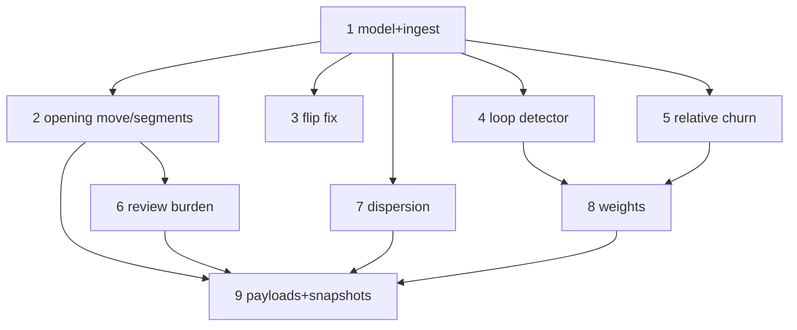

# Plan: Research re-grounding amendments (v0.1, pre-release-gate)

Implements the eight amendments locked 2026-07-18 (SPEC.md §1 "Research
re-grounding amendments"; metric details in docs/metrics-spec.md #7, #9, #13,
#15/#16, #21, #27, #28 and the "Why these default weights" section).

Written for a zero-context implementer. Raphael is learning Rust: annotate new
code heavily and explain non-obvious constructs in plain language in comments.

**Verification loop for every task:** `cargo test --workspace` and
`cargo clippy --workspace -- -D warnings` must pass before the task is done.
Snapshot changes (fixture.rs / mock-payloads) are expected in tasks 8–9 only;
if an earlier task changes a snapshot, stop — it had a side effect the plan
didn't intend.

## File map

| File | Change | Responsibility |
|---|---|---|
| `crates/sumcp-core/src/model.rs` | modify | `Action` gains `write_lines`, `read_total_lines`, `input_hash`; `Finding` gains `nums` map; `FindingKind` gains `ActionLoop`, `ReviewBurden`; `Thrash` renamed `ReRead` |
| `crates/sumcp-core/src/ingest.rs` | modify | populate the three new `Action` fields at parse time (before content capping) |
| `crates/sumcp-core/src/signals/dynamics.rs` | modify | per-segment opening move; flip no-new-evidence fix; consecutive-identical-call loop detector; shared `segments()` helper |
| `crates/sumcp-core/src/signals/edit_shape.rs` | modify | `relative_churn` on Churn findings; `Thrash`→`ReRead` rename fallout |
| `crates/sumcp-core/src/signals/comprehension.rs` | modify | review-burden anchor (NOT auto-accept-suppressed); latency signals stay suppressed |
| `crates/sumcp-core/src/score.rs` | modify | reordered documented default weights; `action_loop` weight; `re_read` breakdown key; relative-churn within-category weighting |
| `crates/sumcp-core/src/report.rs` + `crates/sumcp-mcp/src/*` | modify | `blind_spots` review-burden section; `context_health` dispersion ratio; overview patch-first-segment share |
| `crates/sumcp-core/tests/fixture.rs`, `fixtures/mock-payloads/` | modify | snapshot updates, cap re-checks |

No new modules, no new dependencies, no change to the six-tool MCP surface.

## Task 1 — Model + ingest fields (everything else depends on this)

**Files:** `model.rs`, `ingest.rs`.

1. `Action` gains three `Option` fields, each with a doc comment naming its
   consumer:
   - `write_lines: Option<usize>` — newline count + 1 of the FULL
     `new_string`/`content` tool input, counted in `ingest.rs` **before**
     `norm_cap` truncates it (the existing `write_len` chars stay). Consumer:
     review-burden (#27), relative churn (#7).
   - `read_total_lines: Option<usize>` — for Read actions, the file's total
     line count from `toolUseResult.file.totalLines` (T2 field — inspect
     `fixtures/raw/` first to confirm the exact key; if absent in the fixture
     corpus, fall back to counting lines of the result content ONLY when the
     Read used no `offset`/`limit` input). Consumer: relative churn denominator.
   - `input_hash: Option<u64>` — hash of tool name + the raw serialized
     `tool_use.input` JSON (use `std::hash::DefaultHasher`; byte-identical
     inputs ⇒ equal hashes is all we need). Consumer: loop detector (#21).
2. `Finding` gains `nums: BTreeMap<String, f64>` with
   `#[serde(skip_serializing_if = "BTreeMap::is_empty", default)]` — the one
   mechanism for numeric operationalizations (edit_fraction, first_edit_index,
   relative_churn, loc). Existing findings leave it empty.
3. `FindingKind`: add `ActionLoop` and `ReviewBurden`; rename `Thrash` →
   `ReRead` (compiler-driven rename; payload label changes with it — that is
   the point of the rename, per metrics-spec #21).

**Tests (in-module):** synthetic JSONL lines asserting (a) `write_lines`
counted from a multi-line `content` larger than the cap, (b) `read_total_lines`
picked up from a `toolUseResult` shaped like the fixture corpus, (c) two
byte-identical tool_use lines get equal `input_hash`, differing inputs differ.

## Task 2 — Per-segment opening move (`dynamics.rs`) [parallel with 3, 4 after 1]

Replace whole-session `opening_move` per metrics-spec #9:

1. Helper `segments(s: &Session) -> Vec<Segment>` where a segment is the run
   of main-lane actions between consecutive `user_texts` line numbers (they are
   already isMeta-filtered). Struct carries the leading `UserText` line_no and
   the action slice. Put it in `dynamics.rs`; `pub(crate)` so comprehension
   (task 6) reuses it.
2. Classify **only segments with ≥ 5 tool actions**. Per classified segment
   emit one `OpeningMove` finding: `confidence: Medium`, `exact: false`,
   `nums = {"edit_fraction_first10": …, "first_edit_index": …}`, note names
   read-first vs patch-first AND cites the leading user message line number
   (the narrating agent can overrule a human-directed edit).
3. Session roll-up: `pub fn patch_first_segment_share(s) -> Option<f64>`
   (classified segments only), consumed by overview in task 9.

**Tests:** (a) session where the human's second message directs an immediate
edit → that segment classifies patch-first but confidence is Medium and the
note carries the user line; (b) 3-action segment → not classified; (c) share
computed over classified segments only; (d) old whole-session test updated,
not deleted — first segment must reproduce its verdict.

## Task 3 — Flip fix: no-new-evidence condition (`dynamics.rs`) [parallel]

Locked decision #3 + FlipFlop caveat: a revert is a `Flip` only if pushback
occurred between the edits **and no new evidence was gathered between the
pushback message and the reverting edit**. Evidence = any `Read` action or any
`Bash` action (test output is evidence regardless of pass/fail) in that span,
any lane.

**Tests:** (a) pushback → failing `cargo test` → revert ⇒ `TrueRevert`, not
`Flip`; (b) pushback → revert with nothing between ⇒ `Flip` (existing test
still passes); (c) pushback → Read of an unrelated file → revert ⇒
`TrueRevert` (evidence is evidence; do not over-fit to same-file).

## Task 4 — Advisory loop detector (`dynamics.rs`) [parallel]

Metrics-spec #21: scan each lane's actions in order; ≥ 3 **consecutive** equal
`input_hash` values ⇒ one `ActionLoop` finding covering the run
(`idxs` = the run, `nums = {"repeats": n}`, `tier: T1`, `exact: true`,
`confidence: Low` — Low is the advisory mechanism: score.rs already applies
`low_confidence_factor`). Runs longer than 3 produce ONE finding, not
overlapping ones.

**Tests:** (a) 3 identical Greps fire once with repeats=3; (b) 2 identical do
not fire; (c) identical inputs interleaved across two lanes do not fire
(consecutive within one lane only); (d) 5 identical ⇒ one finding, repeats=5.

## Task 5 — Relative churn (`edit_shape.rs`) [after 1]

Metrics-spec #7: on each `Churn` finding, when the file has a known denominator
(most recent `read_total_lines` for that file at any earlier action), set
`nums["relative_churn"] = total write_lines across the file's edits / denominator`.
No denominator ⇒ `nums` stays empty and nothing else changes.

**Tests:** (a) 3 edits totalling 30 lines on a 300-line file ⇒
relative_churn = 0.1; (b) no prior Read with totals ⇒ no `relative_churn` key;
(c) denominator updates when a later Read reports a new total.

## Task 6 — Review-burden anchor (`comprehension.rs`) [after 2's helper]

Metrics-spec #27. Restructure `comprehension()`:

- `review_burden(s)` runs **always** — including under auto-accept (that is
  its advantage over latency; the current early-return must not gate it).
- `large_write_instant_accept(s)` keeps the auto-accept suppression exactly
  as-is.

Per segment (reuse task 2's helper): sum `write_lines` over Edit/Write
actions. Sum > 400 (the SmartBear band ceiling, named constant with the
citation in its doc comment) ⇒ one `ReviewBurden` finding:
`tier: T1`, `exact: false`, `confidence: Medium`,
`nums = {"loc": total, "band_hi": 400.0}`, `idxs` = the segment's edit
actions, `file: None` (spans files; the files appear via idxs → evidence()).
Note frames RISK, never verdict: "N lines written before the next human turn —
above the 200–400 LOC review band", nothing about what the human did.

**Not scored:** comprehension findings are already outside `score.rs` ranking
categories — confirm `all_findings` routing keeps `ReviewBurden` out of
`rank()`'s breakdown and in the blind_spots payload (task 9).

**Tests:** (a) 500 summed lines in one segment fires with loc=500; (b) 500
lines spread over two segments (250 each) does not fire; (c) fires under
auto-accept while `LargeWriteInstantAccept` stays suppressed in the same
session; (d) note text contains no claim about the human's reading.

## Task 7 — Localization dispersion (`report.rs` context_health path) [after 1]

Metrics-spec #28: `context_health` payload gains
`"read_edit_file_ratio": Option<f64>` = distinct files read ÷ distinct files
edited, `None` (field omitted) when the session has zero edited files.
Informational only — no Finding, no threshold, no flag. Doc comment names the
v2 cross-session outlier seam.

**Tests:** (a) 10 files read / 2 edited ⇒ 5.0; (b) read-only session ⇒ field
absent from serialized payload.

## Task 8 — Weights re-grounding (`score.rs`) [after 1, 4]

Per metrics-spec "Why these default weights":

1. New defaults, each field's doc comment citing its evidence line:
   `rework: 3.0`, `fumble: 3.0`, `failure_loop: 2.0`, `re_read: 1.5`
   (renamed from `thrash` — TOML key renames with it; pre-1.0, no alias
   needed), `churn: 1.0`, `action_loop: 1.0` (advisory: always lands with
   `Confidence::Low`, so effective 0.5), `low_confidence_factor: 0.5`.
2. Churn within-category weighting: magnitude = `count ×
   clamp(relative_churn, 0.5, 2.0)` when `nums["relative_churn"]` exists,
   else `count`. Clamp bounds are `Weights` fields? No — constants with doc
   comments; they are not evidence-bearing knobs.
3. Module doc comment: weights are editorial-by-construction; order is
   research-derived; payloads must never claim literature-derived.

**Tests:** (a) breakdown key says `re_read`; (b) a 0.05-relative-churn file
scores half a no-denominator file with equal counts (clamp floor);
(c) `ActionLoop` contributes weight × 0.5; (d) default ordering asserted:
rework = fumble > failure_loop > re_read > churn.

## Task 9 — Payload wiring + snapshots (`report.rs`, `sumcp-mcp`) [last]

1. `blind_spots`: `review_burden` section (per-segment incidents, nums, and
   the suppression field now distinguishing "latency suppressed (auto-accept)"
   from review-burden, which never suppresses).
2. `session_overview`: `patch_first_segment_share` (task 2), omitted when no
   segment classified.
3. Re-run fixture snapshots (`tests/fixture.rs`, `fixtures/mock-payloads/`);
   review every diff line against this plan — a snapshot change not explained
   by tasks 1–8 is a bug.
4. Re-run payload cap tests on the largest fixture; all six tools stay under
   their caps (SPEC §2 table).
5. Sweep `docs/payload-schema.md` for the changed/added fields.

**Verification:** `cargo test --workspace`, clippy clean, plus a manual run of
`cargo run -p sumcp-cli -- overview` against a real session confirming the new
fields render.

## Deferred (named so it isn't smuggled in)

- Approval-latency measurement refinements — #15/#16 are demoted, not touched.
- Region-level (hunk-overlap) relative churn — file-level only in v0.1.
- Any cross-session baseline for dispersion — v2 seam.
- Renaming `Weights.source` or TOML migration machinery — pre-1.0, breaking is
  fine.

## Dependency graph

