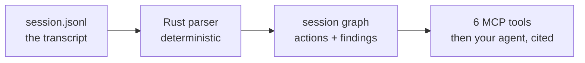

# T5.4 README Showpiece + OSS-Readiness Implementation Plan

> **For agentic workers:** REQUIRED SUB-SKILL: Use superpowers:subagent-driven-development (recommended) or superpowers:executing-plans to implement this plan task-by-task. Steps use checkbox (`- [ ]`) syntax for tracking.

**Goal:** Turn the suMCP README into an authored showpiece (title wordmark, evidence-bound tagline, hero screenshot, two hand-drawn diagrams, a first-person methodology section) and finish the OSS-readiness bundle (dual license, CONTRIBUTING, CHANGELOG, SECURITY, docs/metrics.md, rustdoc, issue templates).

**Architecture:** Docs-and-assets work on top of an unchanged codebase. New visual assets (SVG diagrams, SVG wordmark, PNG screenshot) live under `docs/assets/`. The screenshot is produced by running the existing `sumcp --html` renderer over a sanitized copy of a real session (via `scripts/sanitize.py`), so no real project paths leak and the struggle story stays authentic. The report renderer itself is not touched.

**Tech Stack:** Rust (edition 2024, resolver 3, cargo workspace), the existing `sumcp` CLI, `scripts/sanitize.py` (Python 3), headless Google Chrome for screenshots, hand-authored SVG, GitHub-flavored Markdown.

## Global Constraints

Every task's requirements implicitly include this section. Values are copied verbatim from the spec (`docs/superpowers/specs/2026-07-21-t5.4-readme-showpiece-and-oss-docs-design.md`).

- **No em dashes** in any prose, doc, SVG text, or commit message. Use commas, colons, parentheses, or restructure. Hyphens in compound words and numeric ranges are fine. Gate: `grep -rn "$(printf '\342\200\224')" <files>` returns no output.
- **Voice: confident, evidence-bound.** No claim without a measured number or an explicit hedge. The honesty is the hook, not a disclaimer.
- **No real project paths** in any committed artifact. Forbidden substrings (case-insensitive): `tene_volume`, `sanibel`, `3daerorelief`, `exouser`, `iona-point`, `raphaelhaytene`. Gate: `grep -rniE 'tene_volume|sanibel|3daerorelief|exouser|iona-point|raphaelhaytene' <artifact>` returns no output.
- **License everywhere is `MIT OR Apache-2.0`** (README, `Cargo.toml`, license files must agree).
- **Keep the Win9x report aesthetic.** Do not modify `crates/sumcp-core/src/html.rs` styling.
- **Numbers must match the provenance audit** (`docs/research-provenance-audit.md`). The token claim is: payload `~150 to 290 tokens`, transcripts `tens of thousands to ~1,000,000 tokens`, `median ~800x` reduction, measured as `session_overview` payload vs full transcript at `chars/3.5`.
- **`sumcp-core` stays serde-only** (ADR A2). Add no dependencies.
- Copyright holder for license files: `Raphael Haytene` (confirm exact legal name before publishing; this is the only name to change if wrong).

---

### Task 1: Dual license (MIT OR Apache-2.0)

Reconcile the whole project onto the dual license already locked in the spec. The workspace currently declares `license = "MIT"` and the README says MIT only.

**Files:**
- Create: `LICENSE-MIT`
- Create: `LICENSE-APACHE`
- Delete (if present): `LICENSE` (replaced by the two named files, Rust convention)
- Modify: `Cargo.toml` (workspace `license` field)
- Modify: `README.md` (License section, currently the last section)

**Interfaces:**
- Consumes: nothing.
- Produces: the two license files and the `MIT OR Apache-2.0` string that Task 5 (README) references.

- [ ] **Step 1: Check for an existing LICENSE file**

Run: `ls LICENSE* 2>/dev/null`
Expected: either nothing, or a single `LICENSE`. If a single `LICENSE` exists, note its content style; it will be replaced.

- [ ] **Step 2: Write `LICENSE-MIT`**

```
MIT License

Copyright (c) 2026 Raphael Haytene

Permission is hereby granted, free of charge, to any person obtaining a copy
of this software and associated documentation files (the "Software"), to deal
in the Software without restriction, including without limitation the rights
to use, copy, modify, merge, publish, distribute, sublicense, and/or sell
copies of the Software, and to permit persons to whom the Software is
furnished to do so, subject to the following conditions:

The above copyright notice and this permission notice shall be included in all
copies or substantial portions of the Software.

THE SOFTWARE IS PROVIDED "AS IS", WITHOUT WARRANTY OF ANY KIND, EXPRESS OR
IMPLIED, INCLUDING BUT NOT LIMITED TO THE WARRANTIES OF MERCHANTABILITY,
FITNESS FOR A PARTICULAR PURPOSE AND NONINFRINGEMENT. IN NO EVENT SHALL THE
AUTHORS OR COPYRIGHT HOLDERS BE LIABLE FOR ANY CLAIM, DAMAGES OR OTHER
LIABILITY, WHETHER IN AN ACTION OF CONTRACT, TORT OR OTHERWISE, ARISING FROM,
OUT OF OR IN CONNECTION WITH THE SOFTWARE OR THE USE OR OTHER DEALINGS IN THE
SOFTWARE.
```

- [ ] **Step 3: Write `LICENSE-APACHE`**

Populate with the verbatim Apache License 2.0 text (the canonical text from `https://www.apache.org/licenses/LICENSE-2.0.txt`). Fill the appendix boilerplate with `Copyright 2026 Raphael Haytene`. Do not paraphrase; it must be the exact standard text.

- [ ] **Step 4: Update `Cargo.toml`**

Change the workspace package license line:

```toml
[workspace.package]
version = "0.1.0"
edition = "2024"
license = "MIT OR Apache-2.0"
repository = "https://github.com/rbh227/suMCP"
```

- [ ] **Step 5: Update the README License section**

Replace the current section body with:

```markdown
## License

Dual-licensed under either of

- Apache License, Version 2.0 ([LICENSE-APACHE](LICENSE-APACHE))
- MIT license ([LICENSE-MIT](LICENSE-MIT))

at your option.
```

- [ ] **Step 6: Verify the workspace still parses and the license resolves**

Run: `cargo metadata --no-deps --format-version 1 | grep -o '"license":"MIT OR Apache-2.0"' | head -1`
Expected: `"license":"MIT OR Apache-2.0"` printed for the crates.

Run: `ls LICENSE-MIT LICENSE-APACHE && grep -c "$(printf '\342\200\224')" LICENSE-MIT LICENSE-APACHE`
Expected: both files listed; `0` em dashes in each.

- [ ] **Step 7: Commit**

```bash
git add LICENSE-MIT LICENSE-APACHE Cargo.toml README.md
git rm --cached LICENSE 2>/dev/null; rm -f LICENSE
git commit -m "T5.4: dual-license MIT OR Apache-2.0"
```

---

### Task 2: Demo fixture + hero screenshot

Produce the README hero image: the Win9x report rendered from a sanitized copy of a real, struggle-rich session. Sanitizing keeps the churn/rework/blind-write story while replacing every real path with a deterministic fake one.

**Files:**
- Create: `fixtures/demo/demo-session.jsonl` (sanitizer output, committed)
- Create: `docs/assets/report-screenshot.png`
- Create: `scripts/render_demo_report.sh` (reproducible regen)

**Interfaces:**
- Consumes: `scripts/sanitize.py` (`python3 scripts/sanitize.py <raw.jsonl> <out.jsonl>`), the `sumcp` CLI (`sumcp --file <jsonl> --html` prints a self-contained HTML report to stdout).
- Produces: `docs/assets/report-screenshot.png`, embedded by Task 5.

- [ ] **Step 1: Build the release binary**

Run: `cargo build --release`
Expected: `Finished \`release\` profile`.

- [ ] **Step 2: Sanitize a struggle-rich session into a committable fixture**

Run:
```bash
mkdir -p fixtures/demo
python3 scripts/sanitize.py fixtures/raw/783b02d8-fba8-4edd-a6c2-7c1b4466be53.jsonl fixtures/demo/demo-session.jsonl
```
Expected: `sanitized N lines ... -> fixtures/demo/demo-session.jsonl`. If it reports unrecognized keys, read them; they are scrubbed by default-deny, which is safe for a screenshot.

- [ ] **Step 3: Verify no real path survived sanitizing**

Run: `grep -rniE 'tene_volume|sanibel|3daerorelief|exouser|iona-point|raphaelhaytene' fixtures/demo/demo-session.jsonl`
Expected: no output. If anything prints, stop; the sanitizer allowlist needs a look before continuing.

- [ ] **Step 4: Confirm the sanitized session still tells a struggle story**

Run: `./target/release/sumcp --file fixtures/demo/demo-session.jsonl`
Expected: a ranked struggle list with several files and non-zero churn/rework/re_read counts (the story survived). If the ranking is empty, pick a different raw session with visible struggle and repeat from Step 2.

- [ ] **Step 5: Write the reproducible render script**

Create `scripts/render_demo_report.sh`:
```bash
#!/usr/bin/env bash
# Regenerate the README hero screenshot from the committed demo fixture.
# Requires: cargo, Google Chrome. Usage: scripts/render_demo_report.sh
set -euo pipefail
ROOT="$(cd "$(dirname "$0")/.." && pwd)"
HTML="$(mktemp -t sumcp-demo-XXXX).html"
PNG="$ROOT/docs/assets/report-screenshot.png"
CHROME="/Applications/Google Chrome.app/Contents/MacOS/Google Chrome"

cargo build --release --manifest-path "$ROOT/Cargo.toml"
"$ROOT/target/release/sumcp" --file "$ROOT/fixtures/demo/demo-session.jsonl" --html > "$HTML"
"$CHROME" --headless --disable-gpu --hide-scrollbars \
  --window-size=1100,1400 --screenshot="$PNG" "file://$HTML"
echo "wrote $PNG"
```

- [ ] **Step 6: Run it and produce the PNG**

Run: `chmod +x scripts/render_demo_report.sh && scripts/render_demo_report.sh`
Expected: `wrote .../docs/assets/report-screenshot.png`.

- [ ] **Step 7: Eyeball the screenshot**

Open `docs/assets/report-screenshot.png`. Confirm: the navy titlebar, the Timeline with Read/Edit/Bash lanes, a populated Struggle areas table, Blind spots, and at least one File story are all visible, and no real path text appears. If the image is mostly empty, adjust `--window-size` height or pick a richer session.

- [ ] **Step 8: Commit**

```bash
git add fixtures/demo/demo-session.jsonl scripts/render_demo_report.sh docs/assets/report-screenshot.png
git commit -m "T5.4: sanitized demo fixture + hero report screenshot"
```

---

### Task 3: Two hand-drawn diagrams

Author the two hero diagrams as sketch-style SVGs and keep a diffable Mermaid source for the pipeline. Hand-drawn look = a handwriting font stack plus slightly irregular strokes. Embedded SVG is used (not Mermaid directly) because GitHub's native Mermaid renderer ignores the hand-drawn look.

**Files:**
- Create: `docs/assets/diagram-pipeline.svg`
- Create: `docs/assets/diagram-tokens.svg`
- Create: `docs/assets/diagram-pipeline.mmd` (diffable Mermaid source, honesty-to-code)

**Interfaces:**
- Consumes: nothing.
- Produces: two SVGs embedded by Task 5.

- [ ] **Step 1: Write the pipeline SVG**

Create `docs/assets/diagram-pipeline.svg`. This is a complete, valid starting artifact; refine the wobble/spacing to taste. Font stack gives the handwritten look; keep all label text em-dash-free.

```svg
<svg xmlns="http://www.w3.org/2000/svg" viewBox="0 0 920 240" font-family="'Comic Sans MS','Chalkboard SE','Segoe Print',cursive">
  <style>
    .box{fill:#fffdf5;stroke:#222;stroke-width:2.5;}
    .lbl{font-size:15px;fill:#111;text-anchor:middle;}
    .arr{stroke:#222;stroke-width:2.5;fill:none;}
    .sub{font-size:12px;fill:#555;text-anchor:middle;}
    .foot{font-size:14px;fill:#800000;text-anchor:middle;}
  </style>
  <!-- nodes -->
  <path class="box" d="M14 60 q4 -8 150 -6 q8 40 -2 74 q-70 8 -150 2 q-6 -40 2 -70 z"/>
  <text class="lbl" x="90" y="92">session.jsonl</text>
  <text class="sub" x="90" y="112">the transcript</text>

  <path class="box" d="M232 60 q4 -8 150 -6 q8 40 -2 74 q-70 8 -150 2 q-6 -40 2 -70 z"/>
  <text class="lbl" x="308" y="92">Rust parser</text>
  <text class="sub" x="308" y="112">deterministic</text>

  <path class="box" d="M450 60 q4 -8 150 -6 q8 40 -2 74 q-70 8 -150 2 q-6 -40 2 -70 z"/>
  <text class="lbl" x="526" y="92">session graph</text>
  <text class="sub" x="526" y="112">actions + findings</text>

  <path class="box" d="M668 60 q4 -8 150 -6 q8 40 -2 74 q-70 8 -150 2 q-6 -40 2 -70 z"/>
  <text class="lbl" x="744" y="88">6 MCP tools</text>
  <text class="sub" x="744" y="108">then your agent,</text>
  <text class="sub" x="744" y="124">cited</text>

  <!-- arrows -->
  <path class="arr" d="M170 98 q20 -3 56 0"/>
  <path class="arr" d="M226 98 l-10 -5 m10 5 l-10 6"/>
  <path class="arr" d="M388 98 q20 -3 56 0"/>
  <path class="arr" d="M444 98 l-10 -5 m10 5 l-10 6"/>
  <path class="arr" d="M606 98 q20 -3 56 0"/>
  <path class="arr" d="M662 98 l-10 -5 m10 5 l-10 6"/>

  <text class="foot" x="460" y="196">no LLM  .  no network  .  read-only</text>
</svg>
```

- [ ] **Step 2: Write the diffable Mermaid source**

Create `docs/assets/diagram-pipeline.mmd`:


- [ ] **Step 3: Write the token headline SVG**

Create `docs/assets/diagram-tokens.svg`. Two bars drawn to scale (the tiny one is deliberately near-invisible against the tall one), with only audit-backed numbers.

```svg
<svg xmlns="http://www.w3.org/2000/svg" viewBox="0 0 620 340" font-family="'Comic Sans MS','Chalkboard SE','Segoe Print',cursive">
  <style>
    .big{fill:#c9d9e8;stroke:#222;stroke-width:2.5;}
    .small{fill:#800000;stroke:#222;stroke-width:2.5;}
    .cap{font-size:14px;fill:#111;text-anchor:middle;}
    .num{font-size:13px;fill:#555;text-anchor:middle;}
    .win{font-size:18px;fill:#800000;text-anchor:middle;}
  </style>
  <path class="big" d="M70 30 q60 -4 120 0 q4 130 0 232 q-60 5 -122 0 q-4 -130 2 -232 z"/>
  <text class="cap" x="130" y="284">full transcript</text>
  <text class="num" x="130" y="304">tens of thousands</text>
  <text class="num" x="130" y="320">to ~1,000,000 tok</text>

  <rect class="small" x="430" y="258" width="120" height="6" rx="2"/>
  <text class="cap" x="490" y="284">suMCP payload</text>
  <text class="num" x="490" y="304">~150 to 290 tok</text>

  <text class="win" x="310" y="26">median ~800x smaller</text>
</svg>
```

- [ ] **Step 4: Verify the SVGs are well-formed and render**

Run:
```bash
for f in docs/assets/diagram-pipeline.svg docs/assets/diagram-tokens.svg; do
  python3 -c "import xml.dom.minidom,sys; xml.dom.minidom.parse('$f'); print('ok $f')"
done
```
Expected: `ok` for both (well-formed XML).

Run: `grep -n "$(printf '\342\200\224')" docs/assets/diagram-*.svg docs/assets/diagram-pipeline.mmd`
Expected: no output.

- [ ] **Step 5: Render both to PNG to confirm they look right**

Run:
```bash
CHROME="/Applications/Google Chrome.app/Contents/MacOS/Google Chrome"
for f in diagram-pipeline diagram-tokens; do
  "$CHROME" --headless --disable-gpu --window-size=960,400 \
    --screenshot="$(mktemp -t $f-XXXX).png" "file://$PWD/docs/assets/$f.svg"
done
```
Open the two PNGs and confirm the boxes, arrows, labels, and numbers read clearly. Adjust the SVG paths if any label overflows its box.

- [ ] **Step 6: Commit**

```bash
git add docs/assets/diagram-pipeline.svg docs/assets/diagram-tokens.svg docs/assets/diagram-pipeline.mmd
git commit -m "T5.4: hand-drawn pipeline + token diagrams"
```

---

### Task 4: Title wordmark (author picks from options)

Produce 2 to 3 SVG wordmark options for "suMCP" in a bold retro style that bridges the navy/teal Win9x titlebar and the hand-drawn diagrams, then let the author choose one. This task ends with exactly one committed wordmark.

**Files:**
- Create (temporary): `docs/assets/wordmark-option-a.svg`, `-option-b.svg`, `-option-c.svg`
- Create (final): `docs/assets/wordmark.svg` (the chosen one, renamed)

**Interfaces:**
- Consumes: nothing.
- Produces: `docs/assets/wordmark.svg`, embedded at the very top of the README by Task 5.

- [ ] **Step 1: Write option A (Win9x titlebar riff)**

Create `docs/assets/wordmark-option-a.svg`:
```svg
<svg xmlns="http://www.w3.org/2000/svg" viewBox="0 0 520 120">
  <rect x="6" y="18" width="508" height="84" fill="#000080" stroke="#000" stroke-width="2"/>
  <rect x="6" y="18" width="508" height="20" fill="#1084d0"/>
  <text x="26" y="86" font-family="'MS Sans Serif',Tahoma,Geneva,sans-serif" font-size="56" font-weight="bold" fill="#fff">suMCP</text>
  <text x="330" y="80" font-family="'Courier New',monospace" font-size="16" fill="#c0c0c0">post-session forensics</text>
</svg>
```

- [ ] **Step 2: Write option B (hand-lettered)**

Create `docs/assets/wordmark-option-b.svg`:
```svg
<svg xmlns="http://www.w3.org/2000/svg" viewBox="0 0 520 120">
  <text x="20" y="80" font-family="'Comic Sans MS','Chalkboard SE',cursive" font-size="62" font-weight="bold" fill="#111">suMCP</text>
  <path d="M22 92 q120 10 300 2" stroke="#800000" stroke-width="4" fill="none"/>
  <text x="24" y="112" font-family="'Comic Sans MS',cursive" font-size="15" fill="#555">what your agent actually did</text>
</svg>
```

- [ ] **Step 3: Write option C (chunky pixel/teal)**

Create `docs/assets/wordmark-option-c.svg`:
```svg
<svg xmlns="http://www.w3.org/2000/svg" viewBox="0 0 520 120">
  <rect x="0" y="0" width="520" height="120" fill="#008080"/>
  <text x="24" y="82" font-family="'Courier New',monospace" font-size="60" font-weight="bold" fill="#fff" letter-spacing="2">suMCP</text>
  <rect x="26" y="92" width="256" height="6" fill="#c0c0c0"/>
</svg>
```

- [ ] **Step 4: Render all three and present to the author**

Run:
```bash
CHROME="/Applications/Google Chrome.app/Contents/MacOS/Google Chrome"
for o in a b c; do
  "$CHROME" --headless --disable-gpu --window-size=560,140 \
    --screenshot="$PWD/docs/assets/wordmark-option-$o.png" "file://$PWD/docs/assets/wordmark-option-$o.svg"
done
```
Show the three PNGs to the author and ask which one to keep (or which to refine). This is a decision gate; do not proceed until the author picks.

- [ ] **Step 5: Finalize the chosen wordmark and remove the rest**

```bash
# replace X with the chosen letter a|b|c
git mv docs/assets/wordmark-option-X.svg docs/assets/wordmark.svg
rm -f docs/assets/wordmark-option-*.svg docs/assets/wordmark-option-*.png
```

- [ ] **Step 6: Verify and commit**

Run: `python3 -c "import xml.dom.minidom; xml.dom.minidom.parse('docs/assets/wordmark.svg'); print('ok')" && grep -c "$(printf '\342\200\224')" docs/assets/wordmark.svg`
Expected: `ok` then `0`.

```bash
git add docs/assets/wordmark.svg
git commit -m "T5.4: title wordmark"
```

---

### Task 5: README showpiece rewrite

Assemble the front page: wordmark, tagline, badges, hero screenshot, honest status line, the first-person "Why I built this" section, and the two diagrams woven into "How it works" and "The numbers". Preserve the existing Install, Quickstart, the six-tool table, and Limitations sections as they are.

**Files:**
- Modify: `README.md`

**Interfaces:**
- Consumes: `docs/assets/wordmark.svg` (Task 4), `docs/assets/report-screenshot.png` (Task 2), `docs/assets/diagram-pipeline.svg` and `docs/assets/diagram-tokens.svg` (Task 3), the dual-license text (Task 1).
- Produces: the finished README.

- [ ] **Step 1: Replace the top of the README (through the first `---`)**

Replace everything from the top of `README.md` down to and including the first horizontal rule with:

```markdown
<p align="center">
  
</p>

<p align="center"><b>The agent tells you what it built. suMCP tells you what it actually did.</b></p>

<p align="center">
  
  
  
  
</p>

<p align="center">
  
</p>

> **v0.1 pre-release.** Validated on the author's own projects across many
> session types. The ranking is proven to run and generalize; its top-3
> accuracy has been spot-checked, not yet systematically measured (see
> [Limitations](#limitations)). Not yet published to crates.io.

---
```

- [ ] **Step 2: Rewrite the opening "Why" into "Why I built this" (first person)**

Replace the current `## Why` heading with `## Why I built this` and replace its entire body with this draft, then hand it to the author to edit into his own voice. The token paragraph, its footnote, and the `<!-- TODO(T5.3) -->` screenshot comment currently living in this section all get removed here; the token paragraph reappears under "The numbers" in Step 4.

```markdown
## Why I built this

I ship code an agent wrote faster than I can fully understand it. That gap,
the comprehension debt, is the thing I actually wanted a tool for.

When you ask an agent "what did we struggle with this session?", it answers
from a lossy, self-flattering memory of its own context, or it re-reads the
entire transcript, which is enormous. Neither is trustworthy: the first is
narrative, the second is expensive, and both drift from what actually
happened.

The transcript is the evidence. Every edit, every failed command, every time
I pushed back, ordered and timestamped. That record survives compaction and it
survives the agent's self-report. suMCP reads it deterministically, in Rust,
with no LLM and no network, and hands a connected agent a few hundred tokens of
cited, structured evidence instead of a vibe. The tool does not judge; it shows
its work, and the agent is the only intelligence in the loop.
```

- [ ] **Step 3: Put the pipeline diagram into "How it works"**

At the top of the existing `## How it works` section, immediately under the heading, insert:

```markdown
<p align="center">
  
</p>
```

Leave the existing prose (`locate -> ingest -> model -> signals -> score -> Report ...`) in place beneath the image.

- [ ] **Step 4: Add a "The numbers" section with the token diagram**

Insert a new section immediately before `## Install`:

```markdown
## The numbers

<p align="center">
  
</p>

On 15 real sessions across 6 project types (Rust, Python/ML, TS/React, prose,
and more), the core debrief payload was about 150 to 290 tokens against raw
transcripts of tens of thousands to about 1,000,000 tokens: a median ~800x
reduction.[^tok] Same answer, a fraction of the context.

[^tok]: Measured as the `session_overview` payload vs the full transcript at
`chars/3.5`. A full debrief that also reads `struggle_areas` plus a few
`evidence` calls is a small multiple of that, still one to three orders of
magnitude smaller than re-reading the transcript.

---
```

If the old README already carried this paragraph and footnote elsewhere (it did, near the top), remove the old copy so the number appears once.

- [ ] **Step 5: Verify the README is clean, honest, and unbroken**

Run: `grep -n "$(printf '\342\200\224')" README.md`
Expected: no output.

Run: `grep -niE 'tene_volume|sanibel|3daerorelief|exouser|iona-point|raphaelhaytene' README.md`
Expected: no output.

Run:
```bash
for p in docs/assets/wordmark.svg docs/assets/report-screenshot.png docs/assets/diagram-pipeline.svg docs/assets/diagram-tokens.svg; do
  test -f "$p" && echo "ok $p" || echo "MISSING $p"
done
```
Expected: `ok` for all four (no broken image links).

- [ ] **Step 6: Render the README to confirm it reads as a showpiece**

Preview `README.md` in a Markdown renderer (an editor preview pane, or push the branch and view it on GitHub). Confirm: wordmark at top, tagline, four badges, hero screenshot, honest status blockquote, "Why I built this", the pipeline diagram under "How it works", the token diagram under "The numbers", and that every image resolves. Confirm every quantitative claim traces to a measured number or a hedge.

- [ ] **Step 7: Commit**

```bash
git add README.md
git commit -m "T5.4: README showpiece (wordmark, tagline, screenshot, diagrams, methodology)"
```

---

### Task 6: docs/metrics.md

A reader-facing catalog of every shipped metric: definition, tier, exact-vs-heuristic, known limits. Distilled from `docs/metrics-spec.md` and honest about the empirical amendments (blind-write reframed as attempts; `flip`/`true_revert`/`user_corrected` are rare). It must describe what the code fires, not what the original spec wished.

**Files:**
- Create: `docs/metrics.md`

**Interfaces:**
- Consumes: `docs/metrics-spec.md`, and the actual detectors in `crates/sumcp-core/src/signals/`.
- Produces: a doc linked from the README "How it works" section (the existing link to `docs/metrics-spec.md` stays; add a friendlier `docs/metrics.md` link).

- [ ] **Step 1: Enumerate the metrics the code actually fires**

Run: `ls crates/sumcp-core/src/signals/ && grep -rn "pub enum\|Finding" crates/sumcp-core/src/model.rs | head`
Read the signal modules and note the finding kinds that ship: churn, rework, re-read thrash, failure loops, tool fumbles, blind-write attempts, true_revert, flip, user_corrected, plus the comprehension signals (approval latency, large-write-instant-accept). This list is the source of truth for the doc, not the metrics-spec.

- [ ] **Step 2: Write `docs/metrics.md`**

Create the file with one row per shipped metric. Use this structure and fill every cell from the code (no em dashes):

```markdown
# Metrics

Every signal suMCP ships, what it means, and how far to trust it. This is the
reader-facing distillation of [docs/metrics-spec.md](metrics-spec.md); the spec
is the authoritative catalog.

Each finding carries a **tier**, an **exact-vs-heuristic** flag, a
**confidence**, and the action indices that prove it.

| Metric | Tier | Exact or heuristic | What it detects | Known limits |
|--------|------|--------------------|-----------------|--------------|
| Churn | 1 | Exact | Repeated edits to one file in a short window | High churn can be legitimate iteration, not struggle |
| Rework | 1 | Exact | A later edit whose patch hunk overlaps an earlier one | Overlapping hunks can be a deliberate refinement of the same region, not confusion |
| Re-read thrash | 1 | Exact | Re-reading a file already read, interleaved with edits | Re-reading a large file is normal; only counts when interleaved with edits to that same file |
| Failure loops | 1 | Exact | Repeated failing commands attributed to a file | Attribution confidence varies; low confidence counts half |
| Tool fumbles | 1 | Exact | Tool-use errors (e.g. bad arguments) | Some fumbles are trivial (a mistyped path) and not real struggle |
| Blind-write attempts | 2 | Exact | `tool_use_error` "File has not been read yet" | Reframed from metric 8: the harness blocks true blind writes, so this counts attempts |
| true_revert | 1 | Exact | A later edit restores an earlier `old_string` | Rare in practice; high-signal when it fires |
| flip | 1 | Heuristic | A true revert plus intervening user pushback, no new evidence gathered | Rare; excluded across order-uncertain cross-agent pairs |
| user_corrected | 1 | Exact | `userModified: true` on an edit | Rare |
| Approval latency | 3 (pulled forward) | Heuristic | Delta from an Edit/Write proposal to its result, as a proxy for decision time | Suppressed under auto-accept or when no permission event can exist; never reported as exact |
| Large-write-instant-accept | 3 (pulled forward) | Heuristic | A large write accepted almost immediately | Heuristic proxy for comprehension debt |

Fill every `...` above with the real limit from the code and spec before
committing. Ranking is a transparent weighted count: rank = sum of (config
weight x evidence count) per category, always shown as a per-category
breakdown, never a single opaque score, never session-length-based.
```

- [ ] **Step 3: Cross-check the doc against the detectors**

Run: `grep -rn "min_opacity\|churn\|rework\|reread\|blind\|flip\|revert\|fumble\|latency" crates/sumcp-core/src/signals/ | wc -l`
Confirm every metric row in `docs/metrics.md` maps to a detector that exists, and that no shipped detector is missing from the table.

- [ ] **Step 4: Link it from the README and verify no em dashes**

In `README.md` "How it works", change the metrics link to point at both:
```markdown
See [docs/metrics.md](docs/metrics.md) for the reader-facing catalog, or
[docs/metrics-spec.md](docs/metrics-spec.md) for the authoritative spec.
```

Run: `grep -n "$(printf '\342\200\224')" docs/metrics.md`
Expected: no output.

- [ ] **Step 5: Commit**

```bash
git add docs/metrics.md README.md
git commit -m "T5.4: docs/metrics.md reader-facing metric catalog"
```

---

### Task 7: CONTRIBUTING, SECURITY, CHANGELOG

The three standard OSS files. Grouped because each is short and none carries its own test cycle.

**Files:**
- Create: `CONTRIBUTING.md`
- Create: `SECURITY.md`
- Create: `CHANGELOG.md`

**Interfaces:**
- Consumes: `scripts/sanitize.py` (the fixture-donation flow references it).
- Produces: nothing downstream.

- [ ] **Step 1: Write `CONTRIBUTING.md`**

```markdown
# Contributing to suMCP

Thanks for looking. suMCP is a deterministic, read-only Rust MCP server; the
bar for changes is that they stay honest, cheap, and reproducible.

## Dev setup

```bash
git clone https://github.com/rbh227/suMCP && cd suMCP
cargo build
cargo test --workspace
```

## Donating a fixture

The most useful contribution is a real session that suMCP got wrong or right in
an interesting way. Never commit a raw transcript: it contains your paths, code,
and prompts. Sanitize it first:

```bash
python3 scripts/sanitize.py path/to/your/session.jsonl fixtures/your-case.jsonl
```

The sanitizer preserves the structure the parser and signals depend on (ids,
timestamps, tool names, the harness error strings detectors key off) and
synthesizes everything private (paths become deterministic fakes, free text
becomes length-approximate placeholders). Review the output, then open a PR.

## Adding a signal

Detectors live in `crates/sumcp-core/src/signals/`. A new signal must carry a
**tier**, an **exact-vs-heuristic** flag, a **confidence**, and the action
indices that prove it, and must add a fixture that makes it fire (and a
zero-fire case). Ranking stays a transparent weighted count with a visible
per-category breakdown.
```

- [ ] **Step 2: Write `SECURITY.md`**

```markdown
# Security

suMCP is read-only and offline by design:

- It never makes network calls.
- It never executes code from a transcript; it parses text.
- The only files it writes are under `$HOME` (everything self-contained in
  `~/.claude/sumcp/`), and `install` backs up anything it touches and is fully
  reversible with `uninstall`.

## Reporting

If you find a way suMCP reads outside a session file, writes outside its
documented paths, or leaks transcript content, please open a private security
advisory on the GitHub repository rather than a public issue.
```

- [ ] **Step 3: Write `CHANGELOG.md`**

```markdown
# Changelog

All notable changes to this project are documented here. The format follows
[Keep a Changelog](https://keepachangelog.com/en/1.1.0/), and this project aims
to follow [Semantic Versioning](https://semver.org/spec/v2.0.0.html).

## [Unreleased]

### Added
- v0.1 pre-release: six read-only MCP tools (`session_overview`,
  `struggle_areas`, `file_story`, `blind_spots`, `context_health`, `evidence`).
- Deterministic transcript ingest with subagent flat-merge and a total
  ordering contract.
- Self-contained HTML report (`sumcp --file <session> --html`).
- `install` / `uninstall` with a Stop-hook debrief nudge, writing only under
  `$HOME` and fully reversible.
- Dual license: MIT OR Apache-2.0.
```

- [ ] **Step 4: Verify no em dashes**

Run: `grep -n "$(printf '\342\200\224')" CONTRIBUTING.md SECURITY.md CHANGELOG.md`
Expected: no output.

- [ ] **Step 5: Commit**

```bash
git add CONTRIBUTING.md SECURITY.md CHANGELOG.md
git commit -m "T5.4: CONTRIBUTING, SECURITY, CHANGELOG"
```

---

### Task 8: rustdoc verification pass

`sumcp-core` already declares `#![warn(missing_docs)]` and currently emits zero missing-docs warnings. This task confirms the whole workspace documents cleanly and that doc-tests run, and fills any gap that appears.

**Files:**
- Modify (only if warnings appear): public items under `crates/sumcp-core/src/`

**Interfaces:**
- Consumes: nothing.
- Produces: a clean `cargo doc`.

- [ ] **Step 1: Confirm sumcp-core documents with zero missing-docs warnings**

Run: `cargo doc --no-deps -p sumcp-core 2>&1 | grep -c "missing documentation"`
Expected: `0`. If non-zero, add a `///` doc comment to each flagged public item (name says what it is, one line is fine) and re-run until `0`.

- [ ] **Step 2: Confirm the whole workspace builds docs cleanly**

Run: `cargo doc --no-deps --workspace 2>&1 | tail -5`
Expected: `Finished` with no `error:` lines.

- [ ] **Step 3: Confirm doc-tests run in the test suite**

Run: `cargo test --workspace --doc 2>&1 | tail -5`
Expected: a doc-test summary with `test result: ok` (zero doc-tests is acceptable; a failure is not).

- [ ] **Step 4: Commit (only if any doc comment was added)**

```bash
git add -A
git commit -m "T5.4: rustdoc pass, cargo doc clean" || echo "nothing to commit, docs already clean"
```

---

### Task 9: GitHub issue templates

Three templates, including the honesty-tool-specific "signal felt wrong" one that asks for a sanitized fixture.

**Files:**
- Create: `.github/ISSUE_TEMPLATE/bug_report.md`
- Create: `.github/ISSUE_TEMPLATE/feature_request.md`
- Create: `.github/ISSUE_TEMPLATE/signal_felt_wrong.md`
- Create: `.github/ISSUE_TEMPLATE/config.yml`

**Interfaces:**
- Consumes: nothing.
- Produces: nothing downstream.

- [ ] **Step 1: Write `bug_report.md`**

```markdown
---
name: Bug report
about: Something crashed or behaved wrong
labels: bug
---

**What happened**

**What you expected**

**Repro**
- suMCP version / commit:
- OS:
- Command or tool call:

**A sanitized fixture, if you can share one**
Run `python3 scripts/sanitize.py <session>.jsonl fixtures/repro.jsonl` and attach the output.
```

- [ ] **Step 2: Write `feature_request.md`**

```markdown
---
name: Feature request
about: Suggest a signal or capability
labels: enhancement
---

**The problem you are trying to see**

**What suMCP would need to detect or show**

**Why it stays honest and cheap**
suMCP is deterministic, read-only, and offline. How does this fit that?
```

- [ ] **Step 3: Write `signal_felt_wrong.md`**

```markdown
---
name: A signal felt wrong
about: The ranking accused the wrong file, or missed a real struggle
labels: signal-accuracy
---

suMCP is an honesty tool, so a wrong accusation matters more than a miss. Thank
you for reporting it.

**What the ranking said**
(the top files and their score breakdown)

**What actually happened in that session**

**Which was it**
- [ ] false accusation (a file was ranked that you did not struggle with)
- [ ] miss (a file you struggled with was not ranked)

**A sanitized fixture**
This is the most useful part. Run
`python3 scripts/sanitize.py <session>.jsonl fixtures/felt-wrong.jsonl`
and attach the output so the case can become a regression test.
```

- [ ] **Step 4: Write `config.yml`**

```yaml
blank_issues_enabled: true
contact_links:
  - name: Security report
    url: https://github.com/rbh227/suMCP/security/advisories/new
    about: Please report security issues privately, not as a public issue.
```

- [ ] **Step 5: Verify front matter and no em dashes**

Run:
```bash
for f in .github/ISSUE_TEMPLATE/*.md; do head -1 "$f" | grep -q '^---$' && echo "ok $f" || echo "BAD front matter $f"; done
grep -rn "$(printf '\342\200\224')" .github/ISSUE_TEMPLATE/
```
Expected: `ok` for each `.md`; no em-dash output.

- [ ] **Step 6: Commit**

```bash
git add .github/ISSUE_TEMPLATE/
git commit -m "T5.4: GitHub issue templates incl. signal-felt-wrong"
```

---

## Final verification (run after all tasks)

- [ ] `cargo test --workspace` is green.
- [ ] `cargo doc --no-deps --workspace` finishes with no errors and no missing-docs warnings.
- [ ] `grep -rn "$(printf '\342\200\224')" README.md docs/metrics.md CONTRIBUTING.md SECURITY.md CHANGELOG.md docs/assets/*.svg .github/ISSUE_TEMPLATE/` returns no output.
- [ ] `grep -rniE 'tene_volume|sanibel|3daerorelief|exouser|iona-point|raphaelhaytene' README.md fixtures/demo/ docs/assets/*.svg` returns no output.
- [ ] `Cargo.toml`, `LICENSE-MIT`, `LICENSE-APACHE`, and the README License section all agree on `MIT OR Apache-2.0`.
- [ ] The README renders in a Markdown preview with the wordmark, tagline, four badges, hero screenshot, honest status blockquote, "Why I built this", pipeline diagram, and token diagram, all images resolving.
- [ ] A stranger can go from the README to a working debrief without reading source.
